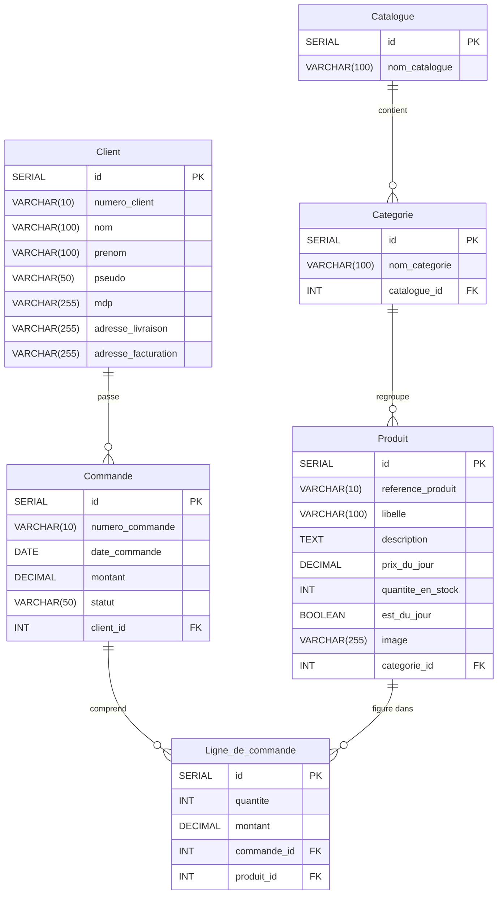

# UML — Base de données Gondor Chic

```mermaid
erDiagram
    Catalogue {
        SERIAL       id             PK
        VARCHAR(100) nom_catalogue
    }

    Categorie {
        SERIAL       id             PK
        VARCHAR(100) nom_categorie
        INT          catalogue_id   FK
    }

    Produit {
        SERIAL       id                PK
        VARCHAR(10)  reference_produit
        VARCHAR(100) libelle
        TEXT         description
        DECIMAL      prix_du_jour
        INT          quantite_en_stock
        BOOLEAN      est_du_jour
        VARCHAR(255) image
        INT          categorie_id      FK
    }

    Client {
        SERIAL       id                    PK
        VARCHAR(10)  numero_client
        VARCHAR(100) nom
        VARCHAR(100) prenom
        VARCHAR(50)  pseudo
        VARCHAR(255) mdp
        VARCHAR(255) adresse_livraison
        VARCHAR(255) adresse_facturation
    }

    Commande {
        SERIAL      id               PK
        VARCHAR(10) numero_commande
        DATE        date_commande
        DECIMAL     montant
        VARCHAR(50) statut
        INT         client_id        FK
    }

    Ligne_de_commande {
        SERIAL  id           PK
        INT     quantite
        DECIMAL montant
        INT     commande_id  FK
        INT     produit_id   FK
    }

    Catalogue      ||--o{ Categorie         : "contient"
    Categorie      ||--o{ Produit           : "regroupe"
    Client         ||--o{ Commande          : "passe"
    Commande       ||--o{ Ligne_de_commande : "comprend"
    Produit        ||--o{ Ligne_de_commande : "figure dans"
```
