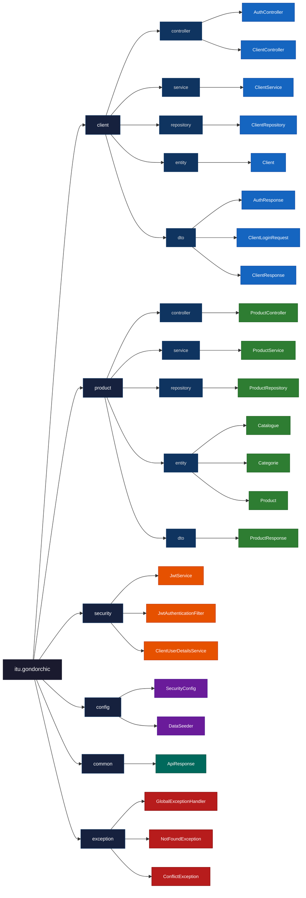

# Architecture Backend — Gondor Chic

```mermaid
graph LR
    ROOT["itu.gondorchic"]

    ROOT --> CLIENT["client"]
    CLIENT --> C_CTRL["controller"]
    CLIENT --> C_SVC["service"]
    CLIENT --> C_REPO["repository"]
    CLIENT --> C_ENTITY["entity"]
    CLIENT --> C_DTO["dto"]

    C_CTRL --> AuthController
    C_CTRL --> ClientController
    C_SVC --> ClientService
    C_REPO --> ClientRepository
    C_ENTITY --> Client
    C_DTO --> AuthResponse
    C_DTO --> ClientLoginRequest
    C_DTO --> ClientResponse

    ROOT --> PRODUCT["product"]
    PRODUCT --> P_CTRL["controller"]
    PRODUCT --> P_SVC["service"]
    PRODUCT --> P_REPO["repository"]
    PRODUCT --> P_ENTITY["entity"]
    PRODUCT --> P_DTO["dto"]

    P_CTRL --> ProductController
    P_SVC --> ProductService
    P_REPO --> ProductRepository
    P_ENTITY --> Catalogue
    P_ENTITY --> Categorie
    P_ENTITY --> Product
    P_DTO --> ProductResponse

    ROOT --> SECURITY["security"]
    SECURITY --> JwtService
    SECURITY --> JwtAuthenticationFilter
    SECURITY --> ClientUserDetailsService

    ROOT --> CONFIG["config"]
    CONFIG --> SecurityConfig
    CONFIG --> DataSeeder

    ROOT --> COMMON["common"]
    COMMON --> ApiResponse

    ROOT --> EXCEPTION["exception"]
    EXCEPTION --> GlobalExceptionHandler
    EXCEPTION --> NotFoundException
    EXCEPTION --> ConflictException

    classDef root    fill:#1a1a2e,color:#ffffff,stroke:#1a1a2e,font-size:15px
    classDef package fill:#16213e,color:#ffffff,stroke:#0f3460,font-size:13px
    classDef sub     fill:#0f3460,color:#e0e0e0,stroke:#0f3460,font-size:12px
    classDef client  fill:#1565C0,color:#ffffff,stroke:#0D47A1,font-size:12px
    classDef product fill:#2E7D32,color:#ffffff,stroke:#1B5E20,font-size:12px
    classDef security fill:#E65100,color:#ffffff,stroke:#BF360C,font-size:12px
    classDef config  fill:#6A1B9A,color:#ffffff,stroke:#4A148C,font-size:12px
    classDef common  fill:#00695C,color:#ffffff,stroke:#004D40,font-size:12px
    classDef exception fill:#B71C1C,color:#ffffff,stroke:#7F0000,font-size:12px

    class ROOT root
    class CLIENT,PRODUCT,SECURITY,CONFIG,COMMON,EXCEPTION package
    class C_CTRL,C_SVC,C_REPO,C_ENTITY,C_DTO,P_CTRL,P_SVC,P_REPO,P_ENTITY,P_DTO sub
    class AuthController,ClientController,ClientService,ClientRepository,Client,AuthResponse,ClientLoginRequest,ClientResponse client
    class ProductController,ProductService,ProductRepository,Catalogue,Categorie,Product,ProductResponse product
    class JwtService,JwtAuthenticationFilter,ClientUserDetailsService security
    class SecurityConfig,DataSeeder config
    class ApiResponse common
    class GlobalExceptionHandler,NotFoundException,ConflictException exception
```
