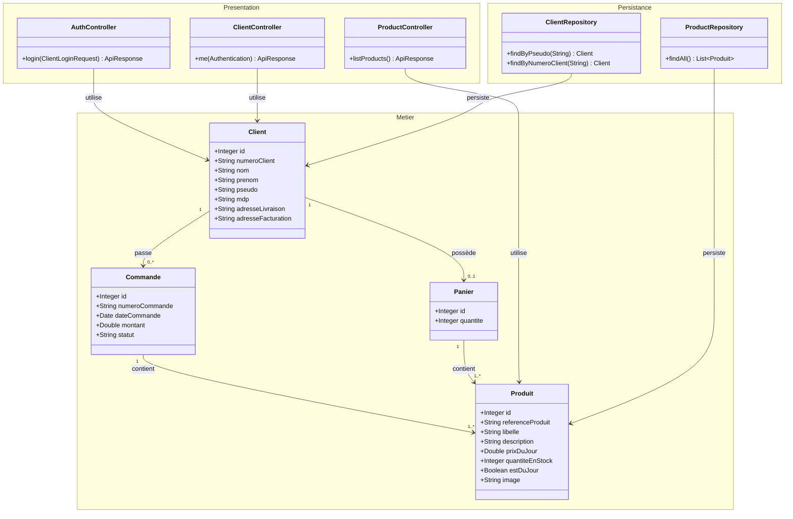

# Diagramme de classes

```mermaid
classDiagram
    namespace Presentation {
        class AuthController {
            +login(ClientLoginRequest) ApiResponse
        }
        class ClientController {
            +me(Authentication) ApiResponse
        }
        class ProductController {
            +listProducts() ApiResponse
        }
    }

    namespace Metier {
        class Client {
            +Integer id
            +String numeroClient
            +String nom
            +String prenom
            +String pseudo
            +String mdp
            +String adresseLivraison
            +String adresseFacturation
        }
        class Produit {
            +Integer id
            +String referenceProduit
            +String libelle
            +String description
            +Double prixDuJour
            +Integer quantiteEnStock
            +Boolean estDuJour
            +String image
        }
        class Commande {
            +Integer id
            +String numeroCommande
            +Date dateCommande
            +Double montant
            +String statut
        }
        class Panier {
            +Integer id
            +Integer quantite
        }
    }

    namespace Persistance {
        class ClientRepository {
            +findByPseudo(String) Client
            +findByNumeroClient(String) Client
        }
        class ProductRepository {
            +findAll() List~Produit~
        }
    }

    Client "1" --> "0..*" Commande : passe
    Commande "1" --> "1..*" Produit : contient
    Client "1" --> "0..1" Panier : possède
    Panier "1" --> "1..*" Produit : contient

    AuthController --> Client : utilise
    ClientController --> Client : utilise
    ProductController --> Produit : utilise
    ClientRepository --> Client : persiste
    ProductRepository --> Produit : persiste
```
