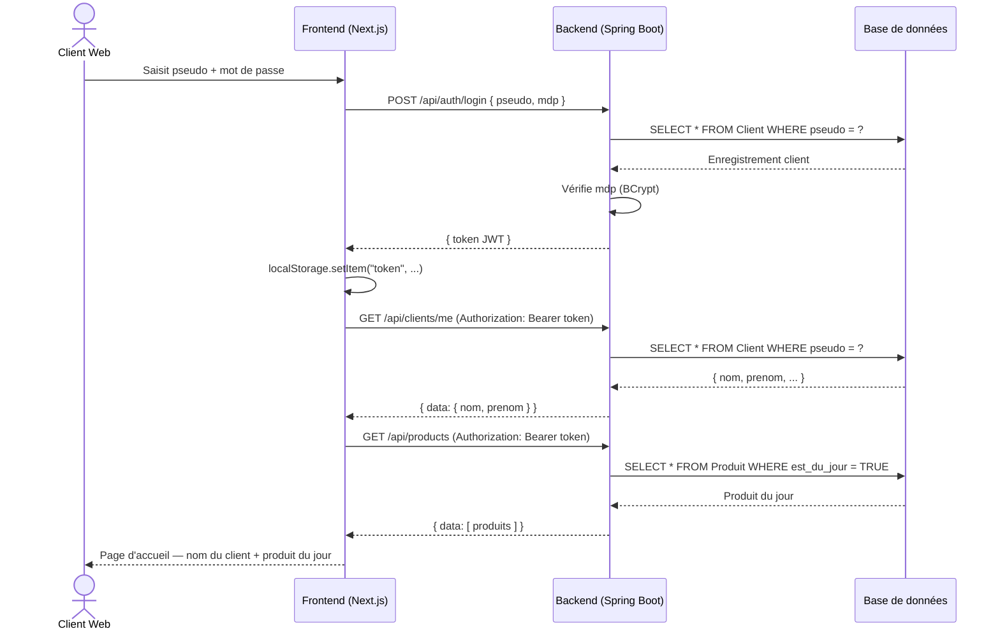

# Diagramme de séquence — Identification

```mermaid
sequenceDiagram
    actor ClientWeb as Client Web
    participant Frontend as Frontend (Next.js)
    participant Backend as Backend (Spring Boot)
    participant DB as Base de données

    ClientWeb->>Frontend: Saisit pseudo + mot de passe
    Frontend->>Backend: POST /api/auth/login { pseudo, mdp }
    Backend->>DB: SELECT * FROM Client WHERE pseudo = ?
    DB-->>Backend: Enregistrement client
    Backend->>Backend: Vérifie mdp (BCrypt)
    Backend-->>Frontend: { token JWT }
    Frontend->>Frontend: localStorage.setItem("token", ...)

    Frontend->>Backend: GET /api/clients/me (Authorization: Bearer token)
    Backend->>DB: SELECT * FROM Client WHERE pseudo = ?
    DB-->>Backend: { nom, prenom, ... }
    Backend-->>Frontend: { data: { nom, prenom } }

    Frontend->>Backend: GET /api/products (Authorization: Bearer token)
    Backend->>DB: SELECT * FROM Produit WHERE est_du_jour = TRUE
    DB-->>Backend: Produit du jour
    Backend-->>Frontend: { data: [ produits ] }

    Frontend-->>ClientWeb: Page d'accueil — nom du client + produit du jour
```
